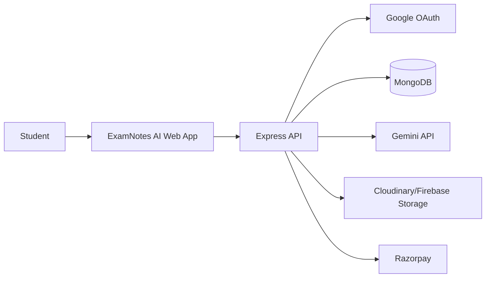

# Architecture

## High-Level Flow

## Frontend

- `public/index.html`: All product pages and semantic structure.
- `public/styles.css`: Responsive dark SaaS design with glass panels, animated particles, charts, skeletons, and mobile navigation.
- `public/app.js`: Routing, demo API interactions, charts, heat map, gems updates, and generation rendering.

## Backend

- `server/index.js`: Express app, security middleware, rate limits, static serving, and API mounting.
- `server/routes/ai.js`: Notes, PYQ analysis, study plan, quiz, and flashcard generation.
- `server/routes/auth.js`: Demo login and Google OAuth integration boundary.
- `server/routes/payments.js`: Gems packages and Razorpay order creation.
- `server/routes/users.js`: Dashboard profile payload.
- `server/services/gemini.js`: Gemini JSON generation wrapper with demo fallback.
- `server/services/gems.js`: Centralized action costs and store packages.

## Database Schema

### User

- Google identity, name, email, avatar
- Gems balance and role
- Dashboard stats
- AI insight scores, weak topics, strong topics

### Generation

- User reference
- Generation type
- Input payload
- AI output payload
- Gems spent

### Payment

- User reference
- Package id
- Gems and amount
- Razorpay order/payment identifiers
- Payment status

## API Routes

| Method | Route | Purpose |
| --- | --- | --- |
| GET | `/api/health` | Health check |
| POST | `/api/auth/demo-login` | Demo auth with signup reward |
| GET | `/api/auth/google` | Google OAuth entry placeholder |
| POST | `/api/ai/notes` | Generate notes |
| POST | `/api/ai/pyq-analysis` | Upload and analyze PYQs |
| POST | `/api/ai/study-plan` | Create day-by-day plan |
| POST | `/api/ai/quiz` | Generate quiz |
| POST | `/api/ai/flashcards` | Generate flashcards |
| GET | `/api/payments/packages` | List gems packages |
| POST | `/api/payments/create-order` | Create Razorpay order |
| GET | `/api/users/me` | Dashboard profile |

## Deployment Guide

1. Create MongoDB Atlas database.
2. Create Gemini API key.
3. Configure Google OAuth callback URL.
4. Create Cloudinary or Firebase Storage credentials.
5. Create Razorpay key pair.
6. Add environment variables from `.env.example` in Vercel.
7. Set Vercel build command to `npm install`.
8. Set Vercel start command to `npm start`.
9. Deploy and verify `/api/health`.

## Production Hardening

- Replace demo auth with Passport Google OAuth session or JWT callback flow.
- Add authenticated middleware to protect AI and payment routes.
- Persist generation history and decrement gems transactionally.
- Add Razorpay signature verification before crediting gems.
- Add PDF/DOCX/OCR extraction workers for large PYQ uploads.
- Add export workers for PDF and DOCX generation.
